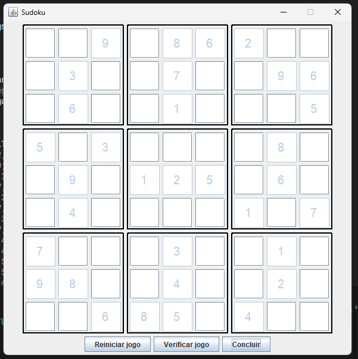

# 🎯 Jogo Sudoku em Java

##  Visão Geral do Projeto

Este é um jogo de Sudoku completo desenvolvido em Java, oferecendo duas interfaces diferentes:
- **Interface de Console** (`Main.java`) - Para jogar via terminal
- **Interface Gráfica** (`UIMain.java`) - Para jogar com interface visual Swing

## ️ Tecnologias e Ferramentas Utilizadas

### **Linguagem e Plataforma**
- **Java 21** - Linguagem principal
- **JDK 21** - Kit de desenvolvimento Java

### **Bibliotecas e Frameworks**
- **Java Swing** - Interface gráfica do usuário
- **Java Collections** - Estruturas de dados (ArrayList, HashMap, Stream)
- **Java Streams** - Processamento de dados funcional

### **Arquitetura e Padrões**
- **MVC (Model-View-Controller)** - Separação de responsabilidades
- **Observer Pattern** - Sistema de notificações entre componentes
- **Service Layer** - Camada de serviços para lógica de negócio
- **Custom Components** - Componentes Swing personalizados

## 🏗️ Estrutura do Projeto

```
jogo_sudoku/
├── src/
│   ├── model/           # Modelos de dados
│   │   ├── Board.java   # Tabuleiro do jogo
│   │   ├── Space.java   # Célula individual
│   │   └── GameStatusEnum.java # Estados do jogo
│   ├── service/         # Lógica de negócio
│   │   ├── BoardService.java    # Serviços do tabuleiro
│   │   ├── NotifierService.java # Sistema de notificações
│   │   └── EventEnum.java       # Tipos de eventos
│   ├── ui/              # Interface do usuário
│   │   ├── custom/      # Componentes personalizados
│   │   │   ├── button/  # Botões customizados
│   │   │   ├── frame/   # Janelas personalizadas
│   │   │   ├── input/   # Campos de entrada
│   │   │   ├── panel/   # Painéis customizados
│   │   │   └── screen/  # Telas principais
│   │   └── MainScreen.java # Tela principal da UI
│   ├── util/            # Utilitários
│   │   └── BoardTemplate.java # Template para exibição
│   ├── Main.java        # Interface de console
│   └── UIMain.java      # Interface gráfica
├── bin/                 # Arquivos compilados
└── lib/                 # Bibliotecas externas
```

## 🎮 Funcionalidades Implementadas

### **Core do Jogo**
- ✅ Tabuleiro 9x9 completo
- ✅ Validação de regras do Sudoku
- ✅ Sistema de posições fixas e editáveis
- ✅ Verificação de erros em tempo real
- ✅ Status do jogo (não iniciado, incompleto, completo)
- ✅ Sistema de reset/reinício

### **Interface de Console (Main.java)**
- ✅ Menu interativo com 8 opções
- ✅ Inserção e remoção de números
- ✅ Visualização do tabuleiro atual
- ✅ Verificação de status do jogo
- ✅ Limpeza e finalização do jogo
- ✅ Validação de entrada do usuário

### **Interface Gráfica (UIMain.java)**
- ✅ Interface visual moderna com Swing
- ✅ Tabuleiro dividido em setores 3x3
- ✅ Campos de entrada para números
- ✅ Botões de controle (Reiniciar, Verificar, Concluir)
- ✅ Validação visual em tempo real
- ✅ Mensagens de feedback para o usuário

## 🔧 O que foi implementado em cada arquivo

### **Main.java - Interface de Console**
```java
// Funcionalidades principais:
- Menu interativo com Scanner
- Gerenciamento de estado do jogo
- Validação de entrada do usuário
- Exibição do tabuleiro usando BoardTemplate
- Lógica de controle do fluxo do jogo
- Tratamento de posições fixas vs. editáveis
```

### **UIMain.java - Interface Gráfica**
```java
// Funcionalidades principais:
- Inicialização da interface Swing
- Configuração automática de argumentos padrão
- Integração com MainScreen
- Gerenciamento de configuração do jogo
- Argumentos padrão para execução sem parâmetros
```

## 🎨 Interface Gráfica

A interface gráfica foi criada usando Java Swing e apresenta:

- **Tabuleiro 9x9** dividido em 9 setores 3x3
- **Células editáveis** para inserção de números
- **Posições fixas** (não editáveis) marcadas visualmente
- **Botões de controle** na parte inferior:
  -  **Reiniciar jogo** - Limpa o tabuleiro
  - ✅ **Verificar jogo** - Verifica status e erros
  - 🏁 **Concluir** - Finaliza e valida o jogo



## 🚀 Como Executar o Projeto

### **Pré-requisitos**
- Java 21 instalado
- JDK 21 configurado

### **Compilação**
```bash
# Na pasta raiz do projeto
javac -d bin src/**/*.java
```

### **Execução**

#### **1. Interface Gráfica (Recomendado)**
```bash
# Executar sem argumentos (usa configuração padrão)
java -cp bin UIMain

# Executar com argumentos personalizados
java -cp bin UIMain "0,0;5,true" "1,1;3,false"........
```

#### **2. Interface de Console**
```bash
# Executar com argumentos
java -cp bin Main "0,0;4,false" "1,0;7,false" "2,0;9,true"........
```

### **Argumentos de Exemplo**
```
0,0;4,false 1,0;7,false 2,0;9,true 3,0;5,false 4,0;8,true 5,0;6,true 6,0;2,true 7,0;3,false 8,0;1,false 0,1;1,false 1,1;3,true 2,1;5,false 3,1;4,false 4,1;7,true 5,1;2,false 6,1;8,false 7,1;9,true 8,1;6,true 0,2;2,false 1,2;6,true 2,2;8,false 3,2;9,false 4,2;1,true 5,2;3,false 6,2;7,false 7,2;4,false 8,2;5,true 0,3;5,true 1,3;1,false 2,3;3,true 3,3;7,false 4,3;6,false 5,3;4,false 6,3;9,false 7,3;8,true 8,3;2,false 0,4;8,false 1,4;9,true 2,4;7,false 3,4;1,true 4,4;2,true 5,4;5,true 6,4;3,false 7,4;6,true 8,4;4,false 0,5;6,false 1,5;4,true 2,5;2,false 3,5;3,false 4,5;9,false 5,5;8,false 6,5;1,true 7,5;5,false 8,5;7,true 0,6;7,true 1,6;5,false 2,6;4,false 3,6;2,false 4,6;3,true 5,6;9,false 6,6;6,false 7,6;1,true 8,6;8,false 0,7;9,true 1,7;8,true 2,7;1,false 3,7;6,false 4,7;4,true 5,7;7,false 6,7;5,false 7,7;2,true 8,7;3,false 0,8;3,false 1,8;2,false 2,8;6,true 3,8;8,true 4,8;5,true 5,8;1,false 6,8;4,true 7,8;7,false 8,8;9,false
```

**Formato dos argumentos:** `linha,coluna;valor,fixo`
- `0,0;4,false` = Posição (0,0) com valor 4, não fixo
- `1,1;3,true` = Posição (1,1) com valor 3, fixo

## 🎯 Características Técnicas

- **Arquitetura modular** com separação clara de responsabilidades
- **Sistema de eventos** para comunicação entre componentes
- **Validação em tempo real** das regras do Sudoku
- **Interface responsiva** com feedback visual
- **Código limpo** seguindo boas práticas de programação
- **Tratamento de erros** robusto

##  Funcionalidades Avançadas

- **Sistema de notificações** entre componentes
- **Componentes Swing customizados** para melhor UX
- **Validação automática** de entrada do usuário
- **Persistência de estado** durante a sessão
- **Interface adaptativa** para diferentes tamanhos de tela

## 👤 Autor

Desenvolvido por **Ariel França**.

## 🤝 Contribuição

Sinta-se à vontade para contribuir com este projeto! Sugestões, melhorias e pull requests são muito bem-vindos. Basta abrir uma issue ou enviar um PR para colaborar.
